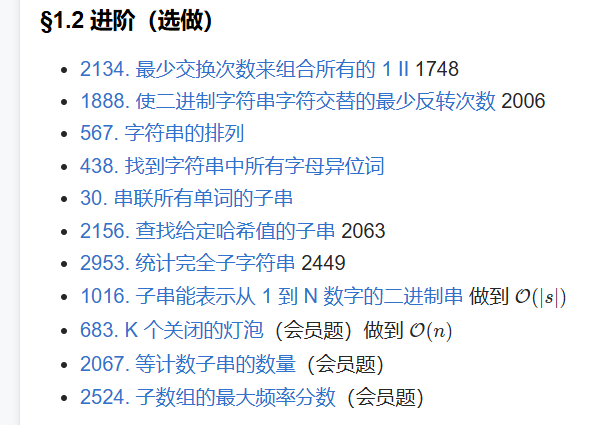

# 一、定长滑动窗口 - §1.2 进阶（选做）

---

进阶版的定长滑动窗口问题通常涉及更复杂的条件和更灵活的窗口管理。以下是你提到的一些题目的分析和思路，重点是如何运用滑动窗口技巧处理这些进阶问题。每个问题的核心思想和可能的解法如下：

### 1. **2134. 最少交换次数来组合所有的 1 II**
   - **题目分析**：给定一个由 `0` 和 `1` 组成的数组，要求将所有的 `1` 移动到数组的前面，最少交换次数。
   - **进阶滑动窗口**：该问题可以通过滑动窗口技术来优化。在滑动窗口内计算 `1` 的数量，并用窗口内的 `0` 来替换掉 `1`，从而最小化交换次数。
   - **核心思路**：用一个窗口包含所有的 `1`，然后计算窗口内的 `0` 数量，这个数量即为交换次数。
   - **时间复杂度**：O(n)。

### 2. **1748. 使二进制字符串字符交替的最少反转次数**
   - **题目分析**：给定一个二进制字符串，要求将字符串中的字符变为交替的形式（即 `0101...` 或 `1010...`），并且最少反转次数。
   - **滑动窗口技巧**：可以通过滑动窗口来计算在每次反转时需要修改的字符数。对于两个模式（`0101...` 和 `1010...`），分别计算需要反转的次数，最终取最小值。
   - **核心思路**：使用滑动窗口计算当前窗口内需要变换的字符数，然后在整个字符串上滑动，更新最少反转次数。
   - **时间复杂度**：O(n)。

### 3. **567. 字符串的排列**
   - **题目分析**：给定两个字符串 `s` 和 `p`，要求找到字符串 `s` 中所有是 `p` 排列的子串。
   - **滑动窗口技巧**：维护一个窗口，并记录窗口中每个字符的频次。当窗口大小等于 `p` 的长度时，检查窗口中字符的频次是否与 `p` 中字符的频次相同。
   - **核心思路**：使用一个频次数组记录窗口内字符的频次，并与目标字符串 `p` 的频次数组进行比较。
   - **时间复杂度**：O(n)。

### 4. **438. 找到字符串中所有字母异位词**
   - **题目分析**：给定一个字符串 `s` 和一个模式字符串 `p`，找出所有 `s` 中与 `p` 异位的子串。
   - **滑动窗口技巧**：与上题类似，使用滑动窗口和频次数组来实现。遍历 `s`，并检查窗口内的字符是否与 `p` 的字符匹配。
   - **核心思路**：通过频次比较来判断窗口内的字符是否可以构成 `p` 的异位词。
   - **时间复杂度**：O(n)。

### 5. **30. 串联所有单词的子串**
   - **题目分析**：给定一个字符串 `s` 和一个单词列表 `words`，要求找到 `s` 中所有是 `words` 中单词串联的子串的起始索引。
   - **滑动窗口技巧**：首先将所有单词的总长度求出，然后使用滑动窗口来查找长度为 `words` 总长度的子串。每次滑动窗口时，检查该子串是否可以分解为 `words` 中的单词。
   - **核心思路**：使用滑动窗口遍历字符串，并检查窗口内的单词是否匹配 `words` 中的所有单词。
   - **时间复杂度**：O(n)。

### 6. **2156. 查找给定哈希值的子串**
   - **题目分析**：给定一个字符串和一个哈希值，要求找到所有子串的哈希值等于给定哈希值的子串。
   - **滑动窗口技巧**：使用滑动窗口遍历字符串，同时维护窗口的哈希值。每次窗口滑动时，更新哈希值并与目标哈希值进行比较。
   - **核心思路**：滑动窗口配合哈希函数，在每次窗口滑动时更新哈希值。
   - **时间复杂度**：O(n)。

### 7. **2063. 统计完全子字符串**
   - **题目分析**：给定一个字符串，要求找出所有完全子串的数量，完全子串指的是一个子串的所有字符出现次数相同。
   - **滑动窗口技巧**：维护一个频次数组，并在每次滑动时更新数组，同时判断当前子串是否符合完全子串的条件（即所有字符的频次相同）。
   - **核心思路**：通过维护一个频次数组，并在每次滑动时判断是否符合条件。
   - **时间复杂度**：O(n)。

### 8. **1016. 子串能表示从 1 到 N 数字的二进制串**
   - **题目分析**：给定一个字符串，要求找出所有能够表示从 `1` 到 `N` 数字的二进制串。
   - **滑动窗口技巧**：通过滑动窗口遍历字符串，同时将每个窗口内的二进制数转化为十进制数，检查其是否在 `1` 到 `N` 的范围内。
   - **核心思路**：滑动窗口可以帮助你逐步获取每个子串，然后转化为二进制并检查范围。
   - **时间复杂度**：O(n)。

### 9. **683. K 个关闭的灯泡（会员题）**
   - **题目分析**：给定一个灯泡的状态序列和一个整数 K，要求找出 K 次反转操作后，灯泡为关闭状态的子序列。
   - **滑动窗口技巧**：使用滑动窗口来计算反转操作次数，更新每个灯泡的状态，并维护一个计数器来判断是否满足 K 次反转。
   - **核心思路**：利用滑动窗口来遍历状态序列，同时更新反转次数。
   - **时间复杂度**：O(n)。

### 总结
进阶版的定长滑动窗口问题，通常不仅仅是求和或最大值，还可能涉及到频次统计、哈希值计算、字母异位词匹配等更复杂的条件。此类问题通常需要在窗口中维护一些额外的信息，如字符的频次、哈希值等，来实现有效的计算和更新。

滑动窗口的进阶使用要求对窗口的操作更加灵活和复杂，常常与哈希表、频次数组等数据结构配合使用。同时，对于有多个匹配条件或约束的问题，滑动窗口可以高效地在每次滑动时进行状态更新，从而避免暴力方法的高时间复杂度。