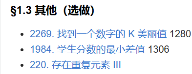

# 一、定长滑动窗口 - §1.3 其他（选做）

---

在“其他（选做）”部分的题目中，涉及的一些问题虽然不完全属于定长滑动窗口的经典应用场景，但也可以通过滑动窗口技巧或其他相关技巧来解决。下面对这些题目进行分析，并讨论可能的解法。

### 1. **2269. 找到一个数字的 K 美丽值**
   - **题目分析**：给定一个整数数组，要求找出一个数字的 "K 美丽值"。具体来说，数字的 K 美丽值指的是从数组中任意选取 K 个元素的子集，计算这些元素的和，求出和最大的子集的美丽值。
   - **滑动窗口技巧**：本题的关键是找到一个子集的最大和，滑动窗口可以用来在数组中计算滑动子数组的和。在窗口大小为 K 时，计算每个窗口的和，更新最大美丽值。
   - **核心思路**：利用滑动窗口遍历整个数组，保持一个窗口，计算当前窗口的和，然后滑动窗口直到找到最大和。
   - **时间复杂度**：O(n)。

### 2. **1984. 学生分数的最小差值**
   - **题目分析**：给定一个学生分数数组和一个整数 K，要求找到 K 个学生之间的最小差值。差值是指选定的 K 个学生的最高分与最低分之差。
   - **滑动窗口技巧**：可以先将分数数组排序，然后使用滑动窗口来选取 K 个学生，计算每个窗口内的最大值与最小值的差值，最终得到最小差值。
   - **核心思路**：排序后使用滑动窗口技术，滑动窗口的大小为 K，每次计算窗口内的最大差值，最终找出最小的差值。
   - **时间复杂度**：排序的时间复杂度是 O(n log n)，滑动窗口的时间复杂度是 O(n)，因此总时间复杂度为 O(n log n)。

### 3. **220. 存在重复元素 III**
   - **题目分析**：给定一个整数数组和两个整数 `k` 和 `t`，要求判断是否存在两个不同的索引 `i` 和 `j`，使得 `|nums[i] - nums[j]| <= t` 且 `|i - j| <= k`。
   - **滑动窗口技巧**：本题可以借助滑动窗口来维护一个滑动范围内的元素，同时利用哈希表（或者树状结构）来快速查找当前窗口中是否存在满足条件的元素。可以使用桶排序（bucket sort）或者平衡树来优化窗口中的查找操作。
   - **核心思路**：维护一个窗口，窗口大小为 `k`，并在窗口内查找是否存在差值不大于 `t` 的元素。为了高效查找，可以用有序集合（如树状集合）来代替普通数组。
   - **时间复杂度**：通常可以通过滑动窗口结合桶排序或树状集合来实现，时间复杂度为 O(n)，但使用树状集合时会有额外的对数时间复杂度。

---

### 总结与思路
这三道题的关键在于如何巧妙地利用滑动窗口技巧和其他数据结构（如哈希表、排序、树状集合等）来优化计算。具体来说：
1. **2269**：滑动窗口可以帮助我们快速计算每个窗口内的和。
2. **1984**：通过排序和滑动窗口，可以高效地计算最小差值。
3. **220**：结合滑动窗口和哈希表/树状集合，能够高效判断是否存在符合条件的元素。

这些题目虽然不完全是经典的滑动窗口问题，但依然可以通过滑动窗口技巧进行优化，尤其是在需要优化遍历和查找的场景下。