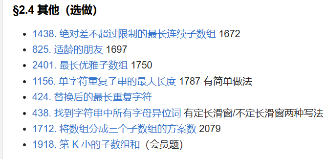

# 二、不定长滑动窗口 - §2.4 其他（选做）

---

这一部分包含了一些较为综合或特定条件的子数组问题，涉及到多种技巧和方法来高效地计算子数组的最大长度、最小长度，或者计算满足某些限制条件的子数组个数。

下面是一些典型的题目解析和解决思路：

### **1438. 绝对差不超过限制的最长连续子数组**
- **问题解析**：给定一个整数数组和一个限制值 `limit`，要求找到一个最长的连续子数组，使得该子数组内任意两个元素的绝对差不超过 `limit`。
- **解法思路**：这道题可以使用滑动窗口技术解决，窗口内的最大值和最小值需要保持在限制 `limit` 之内。因此可以用双端队列（deque）来维护当前窗口中的最大值和最小值。每当当前窗口不符合条件时，左指针会向右移动，直到满足条件为止。
- **时间复杂度**：O(n)，因为每个元素在滑动窗口中最多被处理两次。

---

### **825. 适龄的朋友**
- **问题解析**：给定一个年龄数组和一个年龄差 `diff`，要求统计能够组成“适龄朋友”的人数对。两个年龄 `x` 和 `y` 满足条件 `|x - y| <= diff` 时，它们被认为是适龄朋友。
- **解法思路**：可以将问题转化为滑动窗口的问题。首先对年龄数组排序，然后使用两个指针来遍历数组，一个指针负责扫描当前可能的朋友，另一个指针则用来维护适龄的范围。当两个指针之间的差满足条件时，可以统计符合条件的对数。
- **时间复杂度**：O(n log n)，因为排序需要 O(n log n) 的时间，滑动窗口操作是线性的。

---

### **2401. 最长优雅子数组**
- **问题解析**：要求找到一个最长的子数组，使得子数组内的每个元素都满足某个条件（例如单调、递增、递减等）。
- **解法思路**：这类问题可以通过滑动窗口与双指针的方法来解决。我们需要维护一个有效的窗口，使得窗口内的所有元素满足条件。当条件被破坏时，左指针需要向右移动，恢复有效窗口。
- **时间复杂度**：O(n)，使用滑动窗口可以保证每个元素最多被访问两次。

---

### **1156. 单字符重复子串的最大长度**
- **问题解析**：要求找到一个由单一字符组成的最长重复子串的长度。
- **解法思路**：这道题可以用滑动窗口技巧，固定一个字符，使用滑动窗口遍历数组，记录最长的连续重复子串长度。每当遇到不同字符时，左指针移动至当前字符的下一个位置。
- **时间复杂度**：O(n)，通过滑动窗口可以高效地计算最大长度。

---

### **424. 替换后的最长重复字符**
- **问题解析**：给定一个字符串和一个整数 `k`，你可以通过将最多 `k` 个字符替换为相同字符来使得字符串中的最长重复字符的子串最大化。求这个最大长度。
- **解法思路**：使用滑动窗口来解决，右指针扫描字符串，左指针保证窗口内的字符数不超过 `k` 个。每次窗口内的字符替换不超过 `k` 时，计算当前窗口的长度，更新最大值。
- **时间复杂度**：O(n)，使用滑动窗口可以在一次遍历中解决问题。

---

### **438. 找到字符串中所有字母异位词**
- **问题解析**：给定一个字符串 `s` 和一个模式字符串 `p`，要求找到 `s` 中所有是 `p` 异位词的子串。
- **解法思路**：这道题可以用两种方法：定长滑动窗口和不定长滑动窗口。定长滑动窗口是通过维护一个大小为 `p` 长度的窗口来处理；不定长滑动窗口则通过维护窗口的字符计数来处理。
  - **定长滑动窗口**：使用两个滑动窗口，一个用于当前窗口的字符频次，另一个用于 `p` 的字符频次。当两个窗口的字符频次相同，则认为当前窗口是 `p` 的异位词。
  - **不定长滑动窗口**：通过滑动窗口中不断调整字符计数，直到窗口内字符的数量匹配 `p` 的字符集合。
- **时间复杂度**：O(n)，滑动窗口算法能够在线性时间内解决问题。

---

### **1712. 将数组分成三个子数组的方案数**
- **问题解析**：给定一个数组 `nums`，要求将其分成三个子数组，使得每个子数组的和都在某个给定的范围内。
- **解法思路**：这道题可以通过动态规划或者滑动窗口结合前缀和来处理。首先计算数组的前缀和，然后使用滑动窗口来找到满足条件的子数组。
- **时间复杂度**：O(n)，通过滑动窗口和前缀和可以高效求解。

---

### **1918. 第 K 小的子数组和（会员题）**
- **问题解析**：要求找到数组中第 K 小的子数组和。这个问题可以通过滑动窗口和优先队列结合来高效求解。
- **解法思路**：使用前缀和数组来计算子数组的和，接着利用优先队列来维护当前的前 K 个子数组和，最终得到第 K 小的子数组和。
- **时间复杂度**：O(n log k)，因为我们需要遍历所有子数组并使用优先队列来维护前 K 个最小的子数组和。

---

### 总结：
这部分题目不仅涉及了滑动窗口的基础应用，还包括了一些稍微复杂的题目，考察了滑动窗口、前缀和、优先队列等技术的组合应用。通过这些题目的练习，可以进一步提高在处理数组和字符串类问题时的算法能力。