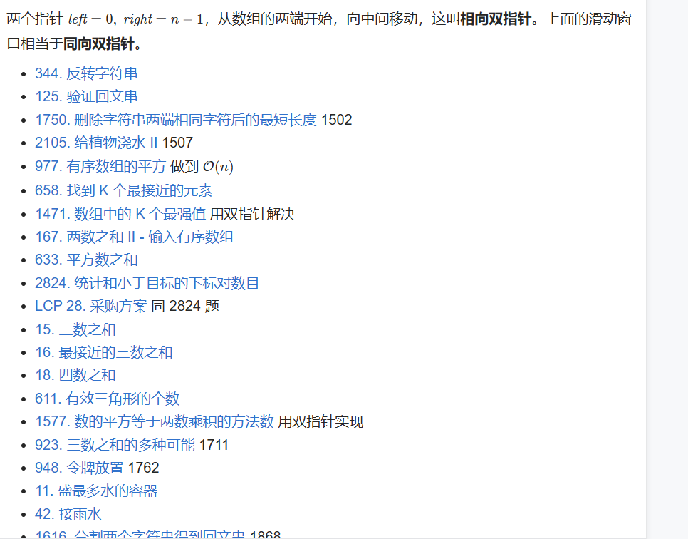

# 三、单序列双指针 - §3.1 相向双指针
  

---
### §3.1 相向双指针

相向双指针技术是一种常用的算法技巧，适用于那些需要从数组的两端同时开始，向中间逐渐逼近的问题。这种方法通常能将问题的时间复杂度降到 O(n)，非常高效。典型的相向双指针应用场景包括：

1. **反转字符串**
2. **验证回文串**
3. **删除字符串两端相同字符后的最短长度**
4. **有序数组的平方**
5. **找到 K 个最接近的元素**
6. **两数之和 II**
7. **三数之和**
8. **四数之和**
9. **盛最多水的容器**
10. **接雨水**

接下来，我将简要分析部分典型题目的解法：

---

### **344. 反转字符串**
- **问题描述**：给定一个字符数组，将其反转。
- **解法思路**：利用相向双指针，从数组两端开始，左指针指向第一个元素，右指针指向最后一个元素。每次交换左指针和右指针指向的元素，然后分别向中间移动，直到两个指针相遇。
- **时间复杂度**：O(n)，其中 n 是字符串的长度。

---

### **125. 验证回文串**
- **问题描述**：给定一个字符串，判断其是否为回文串。回文串是指正读和反读都相同的字符串。
- **解法思路**：使用相向双指针，左指针从字符串的左端开始，右指针从右端开始。每次比较左指针和右指针指向的字符，如果不相等，返回 false。否则，左指针向右移动，右指针向左移动，直到两个指针相遇。
- **时间复杂度**：O(n)，其中 n 是字符串的长度。

---

### **1750. 删除字符串两端相同字符后的最短长度**
- **问题描述**：给定一个字符串，删除两端相同字符后的最短长度。
- **解法思路**：使用相向双指针，左指针从字符串的左端开始，右指针从右端开始。每次比较左指针和右指针指向的字符，如果相同，左右指针都向中间移动。最终，剩下的字符串即为删除两端相同字符后的最短字符串。
- **时间复杂度**：O(n)，其中 n 是字符串的长度。

---

### **977. 有序数组的平方**
- **问题描述**：给定一个有序整数数组，返回每个元素的平方值，并且保持结果数组的非递减顺序。
- **解法思路**：由于原数组是有序的，可以利用相向双指针来优化计算过程。左指针指向数组的起始位置，右指针指向数组的结束位置。将左右指针指向的元素平方后，比较大小，将较大的平方值放入结果数组的末尾，并移动相应的指针。最终得到一个有序的平方数组。
- **时间复杂度**：O(n)，其中 n 是数组的长度。

---

### **658. 找到 K 个最接近的元素**
- **问题描述**：给定一个排序好的数组和一个目标值，找到 K 个最接近目标值的元素。
- **解法思路**：使用相向双指针，初始时将左指针指向数组的最左边，右指针指向数组的最右边。根据目标值与左、右指针对应元素的差值大小，选择最接近目标值的元素。每次将较远的元素移出，直到选出 K 个最接近的元素。
- **时间复杂度**：O(n)，其中 n 是数组的长度。

---

### **167. 两数之和 II - 输入有序数组**
- **问题描述**：给定一个排序好的数组和一个目标值，要求找到数组中两个数的和等于目标值的元素索引。
- **解法思路**：利用相向双指针，左指针从数组的起始位置开始，右指针从数组的末尾开始。每次检查左指针和右指针指向的元素和是否等于目标值。如果和大于目标值，右指针向左移动；如果和小于目标值，左指针向右移动；如果和等于目标值，返回当前的两个指针位置。
- **时间复杂度**：O(n)，其中 n 是数组的长度。

---

### **15. 三数之和**
- **问题描述**：给定一个整数数组，找出所有和为 0 的三元组。
- **解法思路**：首先对数组进行排序。然后通过固定一个数，使用相向双指针来查找另外两个数的和是否为该数的相反数。如果和大于 0，则右指针向左移动；如果和小于 0，则左指针向右移动；如果和为 0，找到一个三元组。
- **时间复杂度**：O(n²)，其中 n 是数组的长度。

---

### **11. 盛最多水的容器**
- **问题描述**：给定一个整数数组，其中每个元素代表一个柱子的高度。求这两个柱子之间的最大水容积。
- **解法思路**：使用相向双指针，初始化时左指针指向数组的第一个元素，右指针指向最后一个元素。每次计算当前容积，并更新最大容积。如果左边柱子的高度小于右边柱子的高度，则左指针向右移动；否则，右指针向左移动。不断更新最大容积，直到左右指针相遇。
- **时间复杂度**：O(n)，其中 n 是数组的长度。

---

### **42. 接雨水**
- **问题描述**：给定一个数组，每个元素代表柱子的高度，求接住的雨水总量。
- **解法思路**：可以使用相向双指针来解。左指针从左边开始，右指针从右边开始。每次计算左右指针之间的区域能够接住多少雨水，并将较小的一侧的指针向内移动，直到左右指针相遇。
- **时间复杂度**：O(n)，其中 n 是数组的长度。

---

### **总结**：

相向双指针方法非常适合处理那些需要在数组的两端向中间推进的问题，尤其是在排序好的数组或需要高效计算某些条件下的子数组或子串时。通过不断地比较、更新指针，能够在 O(n) 或 O(n²) 的时间复杂度内解决很多经典问题。