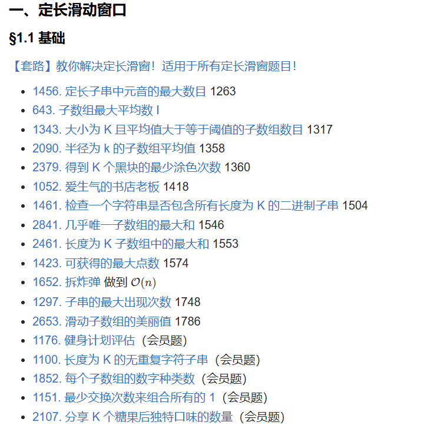

# 一、定长滑动窗口 - §1.1 基础

---
定长滑动窗口（Fixed-Length Sliding Window）是一种常见的算法技巧，适用于处理一系列相邻子数组或子串的问题，特别是当问题涉及到统计、计算某些特定条件或在连续子数组中进行操作时。以下是关于定长滑动窗口的一些思路和技巧，同时我也会结合你提到的题目来解释如何应用这个技巧。

### 定长滑动窗口的核心思想
定长滑动窗口的基本思想是通过维持一个固定大小的窗口，在数组或字符串上滑动，同时跟踪窗口内部的某些统计信息。随着窗口的滑动，我们只需要做常数时间的更新，而不是每次重新计算整个窗口的内容。

具体操作步骤：
1. **初始化窗口**：设置一个固定长度的窗口，通常从数组的开始位置开始。
2. **滑动窗口**：窗口每次向右滑动一格，即向数组的下一个元素扩展（或者收缩）。
3. **更新状态**：每当窗口滑动时，更新窗口内部的状态（例如元素的和、最大值、最小值等）。
4. **记录结果**：根据题目要求，在每次滑动时记录当前窗口的结果。

### 适用场景
- **求和、最大/最小值**：例如求滑动窗口中的最大值、最小值、和等。
- **计数问题**：例如计算窗口内某个元素的频次，或者符合某些条件的元素数量。
- **符合条件的子数组/子串数量**：例如窗口中的某些条件是否满足，记录符合条件的窗口数。

### 题目分析

下面是你提到的几个题目，它们可以通过定长滑动窗口的技巧来解决：

1. **1456. 定长子串中元音的最大数目**
   - **题目分析**：给定一个字符串和一个整数 K，要求找到所有长度为 K 的子串中元音的最大数量。
   - **滑动窗口技巧**：初始化一个窗口，计算第一个窗口内的元音数，然后滑动窗口，更新元音数。当窗口滑动时，只需要减少掉前一个字符的元音计数，增加新的字符的元音计数。
   - **时间复杂度**：O(n)，每次滑动操作的时间复杂度是 O(1)。

2. **643. 子数组最大平均数 I**
   - **题目分析**：给定一个整数数组和一个整数 K，要求找到长度为 K 的子数组的最大平均值。
   - **滑动窗口技巧**：首先计算前 K 个元素的和，然后通过滑动窗口，逐步更新和。每次窗口滑动时，将前一个元素的值减去，新增的元素加上，保持和的更新。
   - **时间复杂度**：O(n)。

3. **1343. 大小为 K 且平均值大于等于阈值的子数组数目**
   - **题目分析**：给定一个整数数组和一个阈值，要求找到所有大小为 K 的子数组中，平均值大于等于阈值的子数组数量。
   - **滑动窗口技巧**：与上一题相似，维护一个窗口和，在每次滑动时更新和，并判断是否大于等于阈值。
   - **时间复杂度**：O(n)。

4. **2379. 得到 K 个黑块的最少涂色次数**
   - **题目分析**：给定一个数组，要求在每次选择一块范围为 K 的子数组，判断最少涂色次数以满足条件。
   - **滑动窗口技巧**：使用滑动窗口维持一个长度为 K 的子数组，计算当前子数组需要涂色的次数，然后更新最少涂色次数。
   - **时间复杂度**：O(n)。

5. **1052. 爱生气的书店老板**
   - **题目分析**：给定一个字符串，要求找到长度为 K 的子串中有最多的不重复字符的数量。
   - **滑动窗口技巧**：维护一个窗口和一个哈希表，记录当前窗口内字符的频率。当窗口滑动时，更新字符频率，并计算窗口内的不重复字符数。
   - **时间复杂度**：O(n)。

6. **2841. 几乎唯一子数组的最大和**
   - **题目分析**：给定一个整数数组和一个整数 K，要求找到所有长度为 K 的子数组的最大和。
   - **滑动窗口技巧**：维护一个固定长度为 K 的窗口，计算每个窗口的和，更新最大和。
   - **时间复杂度**：O(n)。

7. **2461. 长度为 K 子数组中的最大和**
   - **题目分析**：与上一题相似，要求计算长度为 K 的子数组中的最大和。
   - **滑动窗口技巧**：类似上一题，使用滑动窗口计算每个子数组的和，并更新最大和。
   - **时间复杂度**：O(n)。

### 总结
定长滑动窗口的关键在于如何通过固定的窗口大小，在遍历数组的过程中有效地更新窗口中的状态。它适用于所有涉及到“固定大小子数组”的问题，能显著提高效率，避免了暴力算法的时间复杂度。以上提到的题目都可以通过滑动窗口技巧高效解决，核心思路都是维护一个滑动的窗口，并在窗口滑动时不断更新和记录结果。