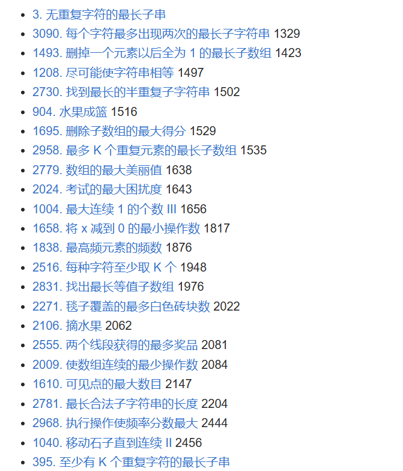

# 二、不定长滑动窗口 - §2.1 求最长/最大

---

在这部分题目中，我们看到很多涉及**最长子串**或**最长子数组**的经典问题，通常带有“至多”或“最多”这样的约束条件。这类问题主要依赖于滑动窗口（双指针）技术来高效地解决。以下是对几个典型题目的分析和解法思路。

### 1. **无重复字符的最长子串**
   - **题目分析**：给定一个字符串，要求找到不含重复字符的最长子串的长度。
   - **解法思路**：使用滑动窗口的双指针技术。通过一个右指针不断扩展窗口，并且使用一个哈希集合来记录窗口内的字符。如果窗口内有重复字符，则左指针右移，直到没有重复字符为止。最终返回窗口的最大长度。
   - **时间复杂度**：O(n)，每个字符至多被访问两次。

### 2. **每个字符最多出现两次的最长子字符串**
   - **题目分析**：要求在给定的字符串中，找出每个字符最多出现两次的最长子字符串。
   - **解法思路**：同样使用滑动窗口。右指针扩展窗口，并通过哈希表记录字符出现的次数。如果某个字符的出现次数超过 2，则左指针右移，直到字符的出现次数满足条件。
   - **时间复杂度**：O(n)，每个字符至多被访问两次。

### 3. **删掉一个元素以后全为 1 的最长子数组**
   - **题目分析**：给定一个二进制数组，要求删除一个元素后，使得剩下的数组中只有 1，且要求删除元素后最长连续 1 的子数组的长度。
   - **解法思路**：通过滑动窗口，记录窗口内 `0` 的个数。当窗口内 `0` 的个数超过 1 时，移动左指针缩小窗口，确保窗口内最多有一个 `0`。每次移动窗口时更新最长的连续 1 的长度。
   - **时间复杂度**：O(n)，每个元素被访问两次。

### 4. **尽可能使字符串相等**
   - **题目分析**：给定一个字符串，要求通过某种操作尽可能使得字符串变得相等，通常是要求将字符串中的字符转化为某种形式。
   - **解法思路**：使用滑动窗口来维护一个字符的窗口，计算窗口内字符的频次，并且通过操作使得窗口内的字符尽量相等。
   - **时间复杂度**：O(n)，窗口大小根据具体操作要求调整。

### 5. **水果成篮**
   - **题目分析**：给定一个数组，表示不同类型的水果，要求找到最多两种水果组成的最长子数组。
   - **解法思路**：使用滑动窗口，右指针扩展窗口，并记录当前窗口内的两种水果类型。如果窗口内的水果种类超过两种，则左指针右移，缩小窗口。
   - **时间复杂度**：O(n)，每个元素最多被访问两次。

### 6. **删除子数组的最大得分**
   - **题目分析**：给定一个数组，要求找到删除一个子数组后的最大得分。得分通常是根据某些条件（如子数组的最大值）计算的。
   - **解法思路**：可以通过滑动窗口来找到得分最大的子数组。维护窗口大小，并在每次扩展时计算当前子数组的得分。
   - **时间复杂度**：O(n)，每个元素最多被访问两次。

### 7. **最多 K 个重复元素的最长子数组**
   - **题目分析**：给定一个数组，要求找到一个子数组，其中最多有 K 个重复元素，求这个子数组的最大长度。
   - **解法思路**：使用滑动窗口，通过哈希表记录每个元素出现的次数。如果某个元素出现的次数超过 K，则左指针右移，缩小窗口。
   - **时间复杂度**：O(n)，每个元素最多被访问两次。

### 8. **考试的最大困扰度**
   - **题目分析**：给定一个学生成绩数组，要求计算出考试的最大困扰度。困扰度通常定义为数组中的最大差值。
   - **解法思路**：通过滑动窗口，遍历数组并在窗口内保持最大和最小值，计算差值来更新困扰度。
   - **时间复杂度**：O(n)，每个元素最多被访问两次。

### 9. **最大连续 1 的个数 III**
   - **题目分析**：给定一个二进制数组，要求找到最多包含 K 个 `0` 的最长连续 1 的子数组。
   - **解法思路**：使用滑动窗口，记录当前窗口中 `0` 的个数，当窗口中 `0` 的个数大于 K 时，左指针右移，缩小窗口，保证窗口内至多有 K 个 `0`。
   - **时间复杂度**：O(n)，每个元素最多被访问两次。

### 10. **最长的美好子字符串**
   - **题目分析**：给定一个字符串，要求找出最长的美好子字符串。美好子字符串的定义通常是具有特定的性质（如字符的出现次数、某些字符关系等）。
   - **解法思路**：使用滑动窗口维护一个符合美好性质的子字符串，并通过移动指针来更新最大长度。
   - **时间复杂度**：O(n)，每个字符最多被访问两次。

### 11. **至多包含 K 个不同字符的最长子串**
   - **题目分析**：要求找到一个最长的子串，其中至多包含 K 个不同字符。
   - **解法思路**：这是经典的滑动窗口问题，右指针扩展窗口，使用哈希表记录字符出现的频次，如果窗口内的不同字符数超过 K，则左指针右移，缩小窗口。
   - **时间复杂度**：O(n)，每个字符最多被访问两次。

### 总结
这些题目大多涉及滑动窗口技巧，核心思路是通过双指针或单指针在数组或字符串中滑动，动态维护窗口状态，优化查找和更新过程。**关键是保证每次扩展和收缩窗口时，能在 O(1) 时间内完成必要的操作**，比如更新窗口中的字符频次、求和或最大值。滑动窗口技巧能够在 O(n) 时间内完成问题求解，非常适合解决这类“最长子串/子数组”的问题。