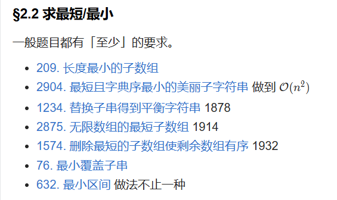

# 二、不定长滑动窗口 - §2.2 求最短/最小

---

在“最短/最小”类题目中，通常都会有“至少”的要求，要求找到符合某些条件的最短子串或子数组。这类题目通常使用**滑动窗口**（双指针）技巧来高效解决，此外，也可能需要借助排序、二分查找、优先队列等其他数据结构来优化解法。下面我们对几个典型题目进行详细分析。

### 1. **209. 长度最小的子数组**
   - **题目分析**：给定一个数组和一个目标值 `S`，要求找到数组中和大于或等于 `S` 的最短子数组的长度。
   - **解法思路**：使用滑动窗口的双指针技术。通过右指针扩展窗口，并维护窗口内的和。如果窗口和大于或等于 `S`，则尝试移动左指针缩小窗口，并更新最小长度。每次更新最小长度时，记录当前窗口的长度。
   - **时间复杂度**：O(n)，每个元素最多被访问两次。

### 2. **2904. 最短且字典序最小的美丽子字符串**
   - **题目分析**：要求找到一个美丽子字符串，子字符串长度最小且字典序最小。美丽子字符串的具体定义可能涉及字符频率或其他条件。
   - **解法思路**：首先使用滑动窗口技术来遍历所有可能的子字符串，并判断哪些子字符串符合“美丽”的条件。对于符合条件的子字符串，记录最短且字典序最小的一个。可以通过逐步更新窗口的方式来维护最优解。
   - **时间复杂度**：O(n²)，因为需要暴力检查所有可能的子字符串并判断其字典序。

### 3. **1234. 替换子串得到平衡字符串**
   - **题目分析**：给定一个字符串 `s`，要求通过替换子串的字符，使得字符串变得“平衡”。具体来说，可能要求每个字符出现的次数相同或满足其他平衡条件。需要找到最小长度的子串并替换。
   - **解法思路**：这类问题可以通过滑动窗口来解决。首先统计字符串中每个字符的频次，然后通过滑动窗口找到一个满足条件的子串，计算其长度，并更新最小长度。
   - **时间复杂度**：O(n)，通过双指针不断调整窗口的大小。

### 4. **2875. 无限数组的最短子数组**
   - **题目分析**：给定一个无限长的数组，要求找到最短的子数组，使得满足特定条件。
   - **解法思路**：通常这类题目需要先将问题转化为有限长度数组的问题，并通过滑动窗口寻找最短子数组。如果数组有周期性，可以利用滑动窗口技术进行优化。具体实现可能涉及对数组进行循环处理（比如重复一次），来模拟无限数组的行为。
   - **时间复杂度**：O(n)，每个元素最多被访问两次。

### 5. **1574. 删除最短的子数组使剩余数组有序**
   - **题目分析**：给定一个数组，要求删除最短的子数组，使得剩下的部分是有序的（非递减或递增）。
   - **解法思路**：可以通过滑动窗口或双指针技术，来找出一个子数组，删除它之后数组剩下部分是有序的。具体操作时，可以先尝试从两端检查数组是否已经有序，然后移动指针找到不满足有序性的最短子数组。
   - **时间复杂度**：O(n)，通过两次遍历数组即可。

### 6. **76. 最小覆盖子串**
   - **题目分析**：给定两个字符串 `s` 和 `t`，要求找到 `s` 中最小的子串，使得该子串包含 `t` 中的所有字符（不一定按顺序）。
   - **解法思路**：这是一道典型的滑动窗口问题。使用两个指针，右指针扩展窗口，直到窗口包含了 `t` 中所有字符，然后左指针收缩窗口，更新最小子串的长度。
   - **时间复杂度**：O(n)，每个字符最多被访问两次。

### 7. **632. 最小区间**
   - **题目分析**：给定多个排序的数组，要求找到一个包含所有数组中至少一个元素的最小区间。
   - **解法思路**：使用优先队列（最小堆）来解决这个问题。首先将每个数组的第一个元素加入堆，然后每次取出最小元素，更新最小区间的左右边界。每次从堆中弹出一个元素时，将其所在数组的下一个元素插入堆中，直到遍历完所有数组。
   - **时间复杂度**：O(n log k)，其中 `n` 是数组元素总数，`k` 是数组的数量。每次插入和删除堆的时间复杂度为 O(log k)。

---

### 总结与解法技巧：
这些题目大多数都涉及到“最短子串”或“最小区间”类问题。可以通过以下技巧来解决：
1. **滑动窗口**：通过双指针（右指针扩展窗口，左指针收缩窗口）来维护当前窗口状态，确保窗口满足特定条件。
2. **优先队列（最小堆）**：对于需要同时维护多个数组元素的最小区间问题，优先队列可以高效地获取最小值并动态更新。
3. **动态规划与贪心策略**：在某些情况下，可能需要结合动态规划或贪心策略来进一步优化问题的求解过程。

这些问题的关键在于如何在遍历中动态维护窗口或区间的状态，并根据题意更新最小值或最短长度。通过滑动窗口和优先队列等数据结构，可以将解法优化到 O(n) 或 O(n log k) 级别。