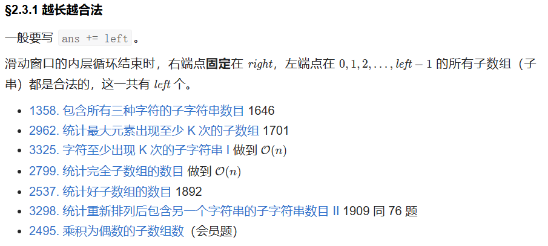
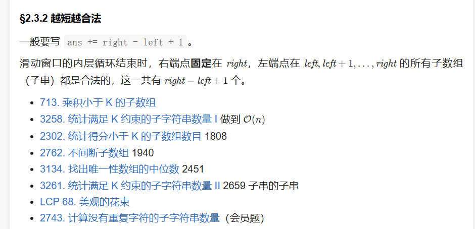
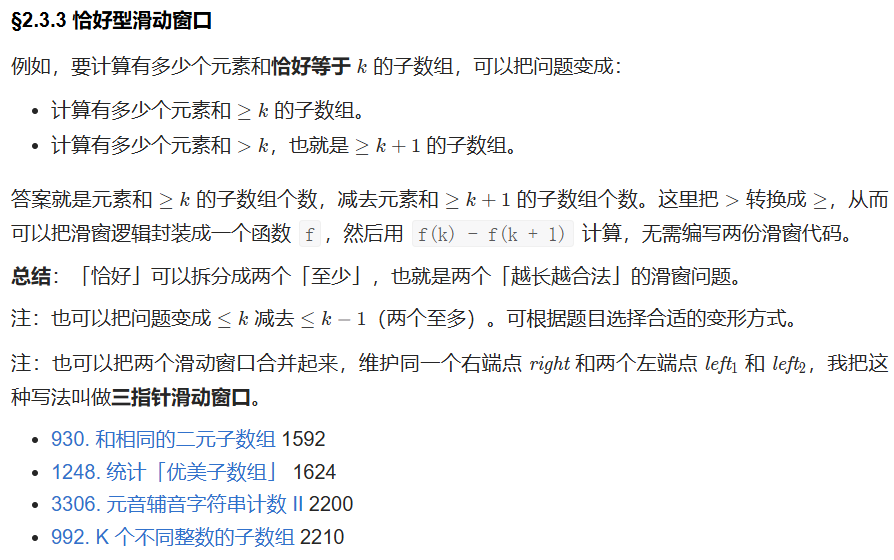

# 二、不定长滑动窗口 - §2.3 求子数组个数
- §2.3.1 越长越合法

- §2.3.2 越短越合法

- §2.3.3 恰好型滑动窗口

---

### 2.3 求子数组个数

这一部分涉及到利用滑动窗口技术计算满足特定条件的子数组的数量。根据子数组的合法性与长度的关系，可以分为几种常见的类型，下面我们逐一分析。

### §2.3.1 越长越合法
在这种情况下，我们需要计算的子数组是以**左端点**作为可变因素，右端点固定时，所有以左端点为起点的子数组都合法。每当内层循环结束时，**右端点固定在右**，所有**从 0 到 left-1** 的左端点都会形成合法的子数组，这时可以通过 `ans += left` 来累加所有合法子数组的个数。

#### 示例题目
1. **1358. 包含所有三种字符的子字符串数目**
   - **题目解析**：我们要计算包含所有三种字符的子字符串的数量。可以通过滑动窗口的方法来维护一个窗口，使得窗口内包含三种字符时，窗口的左端点会不断向右移动，直到满足条件。
   - **解法思路**：通过双指针（滑动窗口）方法，右指针不断扩展窗口，左指针在满足条件时缩小窗口。每次窗口满足条件时，统计当前窗口所有的合法子数组，即 `ans += left`。

2. **2962. 统计最大元素出现至少 K 次的子数组**
   - **题目解析**：要求统计出所有子数组中，最大元素至少出现 K 次的子数组数量。
   - **解法思路**：使用滑动窗口遍历数组，右指针扩展窗口，左指针保证窗口内最大元素出现至少 K 次。如果当前窗口满足条件，则统计所有以当前右端点为结尾的合法子数组。

3. **3325. 字符至少出现 K 次的子字符串 I**
   - **题目解析**：统计字符串中所有字符至少出现 K 次的子串数量。
   - **解法思路**：可以使用滑动窗口来遍历字符串，维护一个哈希表来记录字符的频次，当窗口内的字符满足条件时，统计合法子串的数量。

4. **2799. 统计完全子数组的数目**
   - **题目解析**：统计所有完全子数组的数量，完全子数组可能指的是一些特定的数组，如等差、等比或特定排序的子数组。
   - **解法思路**：滑动窗口可以帮助我们有效地找到所有满足条件的子数组，并根据左端点累加合法子数组的数量。

---

### §2.3.2 越短越合法
这种类型的题目中，我们需要计算**右端点固定时**，所有符合条件的子数组数量。即当右端点固定时，**所有从 left 到 right** 的子数组都是合法的，这一共有 `right - left + 1` 个子数组。

#### 示例题目
1. **713. 乘积小于 K 的子数组**
   - **题目解析**：给定一个数组和一个整数 K，要求计算乘积小于 K 的子数组个数。
   - **解法思路**：使用滑动窗口技术，右指针扩展窗口，左指针根据当前乘积调整，保证窗口内的乘积小于 K，每次右指针扩展时，当前窗口内的所有子数组都是合法的，因此可以统计 `right - left + 1`。

2. **3258. 统计满足 K 约束的子字符串数量 I**
   - **题目解析**：统计所有满足 K 约束的子字符串数量，这里的 K 约束通常是一些限定条件，比如长度限制、字符限制等。
   - **解法思路**：使用滑动窗口来遍历字符串，确保窗口内的子串满足 K 的约束，右指针扩展窗口后，每次统计合法的子串数量。

3. **2302. 统计得分小于 K 的子数组数目**
   - **题目解析**：给定一个数组和一个整数 K，统计得分小于 K 的子数组数量。
   - **解法思路**：同样使用滑动窗口，右指针扩展窗口，左指针根据当前窗口的得分条件进行调整，每次右指针扩展时，统计符合得分小于 K 的所有子数组。

4. **2762. 不间断子数组**
   - **题目解析**：要求计算满足某种不间断条件的子数组数量。
   - **解法思路**：使用滑动窗口的方法，右指针扩展窗口，左指针保证窗口内的子数组符合不间断的条件。

---

### §2.3.3 恰好型滑动窗口
这一部分的题目通常要求我们计算“恰好”满足某个条件的子数组数量。我们可以通过拆分成两个“至少”问题来解决，例如：
- 计算所有子数组和大于或等于 K 的个数，减去计算所有子数组和大于 K 的个数，即可得到和恰好等于 K 的子数组数量。
- 同样也可以利用“至多”问题来进行变形。

#### 示例题目
1. **930. 和相同的二元子数组**
   - **题目解析**：要求统计所有和为相同的二元子数组数量。通过拆分成“和大于等于某值”和“大于某值”的两部分，可以高效计算出和恰好为目标值的子数组数量。
   - **解法思路**：使用滑动窗口计算所有满足和大于或等于某值的子数组数量，再用相同的方法计算和大于目标值的子数组数量，最后求差值。

2. **1248. 统计「优美子数组」**
   - **题目解析**：统计优美子数组的数量，优美子数组可能是指包含特定数量奇数或满足其他条件的子数组。
   - **解法思路**：可以通过拆分为“至多”和“恰好”类型的问题来高效求解。

3. **3306. 元音辅音字符串计数 II**
   - **题目解析**：统计符合元音辅音条件的子数组数量。
   - **解法思路**：利用滑动窗口遍历字符串，计算每个窗口内符合条件的子数组。

4. **992. K 个不同整数的子数组**
   - **题目解析**：要求计算包含恰好 K 个不同整数的子数组数量。
   - **解法思路**：通过将“恰好 K 个不同整数的子数组”转化为“至多 K 个不同整数的子数组”问题来解决。可以使用双指针和滑动窗口技术来优化。

---

### 总结
这些题目利用滑动窗口来高效计算子数组的个数。常见的技巧包括：
1. **越长越合法**：每当右指针扩展时，记录所有以当前右端点为结尾的合法子数组。
2. **越短越合法**：通过保证窗口内的条件，每次右指针扩展时，统计合法子数组的数量。
3. **恰好型滑动窗口**：通过拆分成两个“至少”问题（或“至多”问题），利用滑动窗口求解恰好满足条件的子数组数量。

这些解法可以在 O(n) 时间复杂度内完成，有效解决大规模数据的处理问题。