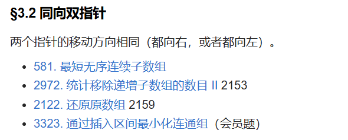

# 三、单序列双指针 - §3.2 同向双指针

---

### §3.2 同向双指针

同向双指针是指两个指针在相同方向上移动（例如，两个指针都向右或都向左）。这种方法通常适用于需要遍历数组时，同时保持对比、更新状态的场景，特别是当一个指针用于遍历某些元素，而另一个指针用于确定某个区间或处理条件时。典型的应用场景包括滑动窗口、合并、搜索等问题。

以下是几道经典题目，它们使用了同向双指针的技巧：

---

### **581. 最短无序连续子数组**
- **问题描述**：给定一个整数数组，你需要找到一个最短的连续子数组，使得该子数组排序后，整个数组也会变成排序的。返回这个子数组的长度。
- **解法思路**：使用同向双指针。首先，遍历数组，找出所有不满足递增顺序的位置。然后，通过两个指针分别扫描左边和右边的不符合位置，更新最短的子数组。最终计算得到最短子数组的长度。
- **时间复杂度**：O(n)，其中 n 是数组的长度。

---

### **2972. 统计移除递增子数组的数目 II**
- **问题描述**：给定一个数组，统计移除递增子数组的数目。递增子数组是指每两个相邻元素大小关系递增的子数组。
- **解法思路**：通过同向双指针维护一个递增子数组的区间。通过遍历数组，并更新左指针和右指针的区间，不断统计当前递增子数组的数量。由于需要在整个数组上做扫描，所以时间复杂度是 O(n)。
- **时间复杂度**：O(n)，其中 n 是数组的长度。

---

### **2122. 还原原数组**
- **问题描述**：给定一个部分排序的数组，要求还原为完整的数组，遵循某些规则（例如，只允许某些位置的交换）。题目需要通过同向双指针处理部分区间。
- **解法思路**：利用同向双指针，在数组的某些位置上进行元素交换或调整，逐步恢复原始数组的顺序。
- **时间复杂度**：O(n)，其中 n 是数组的长度。

---

### **3323. 通过插入区间最小化连通组（会员题）**
- **问题描述**：给定一个区间集合，你需要在某些位置插入新的区间，使得整个集合的连通性最小化。连通组指的是可以通过合并区间得到的最大区间集合。目标是找到最小化连通组数目的操作方式。
- **解法思路**：通过同向双指针扫描已有区间的开始和结束，动态地插入区间来优化结果。通过调整指针的位置，使得每次插入最优。
- **时间复杂度**：O(n)，其中 n 是区间的数量。

---

### 总结

同向双指针技巧用于处理需要在数组或区间中移动并更新状态的问题。与相向双指针的不同之处在于，同向双指针往往会在相同的方向上进行移动，因此它们更多地应用于滑动窗口、合并排序、区间覆盖等场景中。这种方法可以帮助你通过在数组内外的不同位置动态调整区间大小或位置，以获得高效的解决方案。