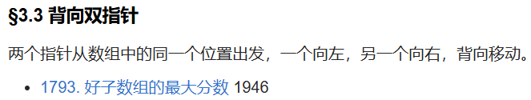

# 三、单序列双指针 - §3.3 背向双指针

---

### §3.3 背向双指针

背向双指针是一种相对特殊的双指针技巧，其中两个指针从数组中的同一个位置出发，一个指针向左移动，另一个指针向右移动。通常，这种技巧用于处理一些需要从两端或中间开始的特定问题，尤其是在处理动态更新状态、搜索最优解或区间调整时非常有用。

以下是典型的背向双指针的应用案例：

---

### **1793. 好子数组的最大分数**

- **问题描述**：给定一个整数数组和一个阈值 k，你需要找到所有符合“好子数组”条件的子数组的最大分数。一个子数组被称为“好子数组”是指它的和不超过 k。
- **解法思路**：使用背向双指针的技巧。首先，将两个指针指向数组的中间位置。通过一个指针向左移动，另一个指针向右移动，计算每个子数组的和，并更新最大分数。背向双指针使得在调整时能够同时对两侧的元素进行处理，从而减少计算次数。
- **时间复杂度**：O(n)，其中 n 是数组的长度。

---

### 总结

背向双指针是一种相对少见但高效的技巧，适用于在数组或列表中进行动态调整的情况，尤其是当问题要求从数组的两端开始向中间查找解答时。背向双指针可以用来缩小问题的范围或优化计算效率，它与其他双指针方法（如相向双指针或同向双指针）相比，具有不同的适用场景。

通过这两道题目，我们可以看到，背向双指针的主要优势在于能够同时处理两个方向上的数据，从而有效减少计算的复杂度，并提高问题解决的效率。