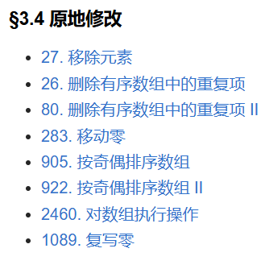

# 三、单序列双指针 - §3.4 原地修改

一共八道题
其中特殊的应该就是
- [80. 删除有序数组中的重复项 II](https://leetcode.cn/problems/remove-duplicates-from-sorted-array-ii/)
- [922. 按奇偶排序数组 II](https://leetcode.cn/problems/sort-array-by-parity-ii/)
- [1089. 复写零](https://leetcode.cn/problems/duplicate-zeros/description/)

---
## 80. 删除有序数组中的重复项 II
- 我的题解：
```cpp
class Solution {
public:
    int removeDuplicates(vector<int>& nums) {
        if (nums.size() <= 2) return nums.size();

        int index = 2; // 最多允许两个重复，所以从第三个位置开始
        for (int i = 2; i < nums.size(); ++i) {
            if (nums[i] != nums[index - 2]) {
                nums[index] = nums[i];
                ++index;
            }
        }
        return index;
    }
};
```
- 虽然参照了GPT，不过还是有两了自己的一些理解，可以理解为维护一个index，保证该index最多允许两个重复。
- i用于遍历数组，index用于保存解信息。

---
## 922. 按奇偶排序数组 II
- 我的题解：
```cpp
class Solution {
public:
    vector<int> sortArrayByParityII(vector<int>& nums) {
        int evenIndex = 0;  // 偶数下标
        int oddIndex = 1;   // 奇数下标
        int n = nums.size();

        while (evenIndex < n && oddIndex < n) {
            // 找到第一个不在偶数位置的奇数
            while (evenIndex < n && nums[evenIndex] % 2 == 0) {
                evenIndex += 2;
            }

            // 找到第一个不在奇数位置的偶数
            while (oddIndex < n && nums[oddIndex] % 2 == 1) {
                oddIndex += 2;
            }

            // 交换它们的位置
            if (evenIndex < n && oddIndex < n) {
                swap(nums[evenIndex], nums[oddIndex]);
            }
        }

        return nums;
    }
};
```

- 也是参照了gpt的思路。

---
## 1089. 复写零
我的题解：
```cpp
class Solution {
public:
    void duplicateZeros(vector<int>& arr) {
        int zeros = 0, n = arr.size();
        
        // 计算新数组长度需要的0的数量
        for (int i = 0; i < n; ++i) {
            if (arr[i] == 0) ++zeros;
        }
        
        int newLength = n + zeros;
        
        // 从最后一个位置开始处理数组，插入0并移动其他元素
        for (int i = n - 1, j = newLength - 1; i >= 0; --i, --j) {
            if (j < n) {
                arr[j] = arr[i];
            }
            if (arr[i] == 0 && --j < n) {
                arr[j] = 0;
            }
        }
    }
};
```
- 思路，通过计算新数组长度，然后减去旧数组长度，便是舍弃的长度，舍弃的元素其实并不用关心，所以只需要关注未被舍弃的元素。
  
---
这些题目都涉及到数组操作，并且多数是以“原地修改”（in-place modification）为主要要求。原地修改意味着我们在操作数组时不能使用额外的数组空间（或只使用常数空间），这对算法的优化提出了挑战。下面我逐一分析这些题目，帮助你理解它们的关键思想。

### 1. **移除元素 (Leetcode 27)**
**题目描述**：给定一个数组和一个值，在数组中移除所有指定值的元素，并返回新数组的长度。要求原地操作，即不使用额外的数组空间。

**理解**：这是一个典型的双指针问题。一个指针遍历数组，另一个指针用来记录修改后的数组的“有效位置”。遇到不等于目标值的元素，就将它放到有效位置，并更新指针。

**思路**：
- 用两个指针：`i` 用于遍历数组，`j` 用于记录新数组的长度。
- 每次遇到不等于目标值的元素时，将它放到`j`位置，然后`j`加一。

### 2. **删除有序数组中的重复项 (Leetcode 26)**
**题目描述**：给定一个排序数组，删除重复项，使得每个元素只出现一次，返回删除重复元素后的新数组的长度。

**理解**：数组已排序，因此可以利用数组的顺序，采用双指针方法，遍历数组并检查相邻的元素是否相等，若相等则跳过，不相等则将当前元素移动到新的有效位置。

**思路**：
- 使用两个指针，`i`遍历数组，`j`用来记录新数组的位置。
- 遇到与前一个不同的元素时，更新`j`位置，并将新元素放到`j`位置。

### 3. **删除有序数组中的重复项 II (Leetcode 80)**
**题目描述**：给定一个排序数组，删除重复元素，使得每个元素最多出现两次。返回修改后的数组的长度。

**理解**：这是对上一题的扩展，要求每个元素最多出现两次。可以使用一个计数器来限制元素的重复次数。

**思路**：
- 使用两个指针，一个指针遍历数组，另一个指针记录新数组的位置。
- 额外维护一个计数器，记录当前元素的重复次数，如果超过两次则跳过。

### 4. **移动零 (Leetcode 283)**
**题目描述**：给定一个数组，将数组中的所有零移动到末尾，非零元素保持原来的相对顺序。

**理解**：这也是一个双指针问题。一个指针遍历数组，另一个指针用于记录下一个非零元素的位置。

**思路**：
- 使用一个指针遍历数组，遇到非零元素时，将它放到新的有效位置。
- 在遍历完数组后，所有的非零元素都已经被放置到数组前面，而零元素则自然会“推到”数组的末尾。

### 5. **按奇偶排序数组 (Leetcode 905)**
**题目描述**：给定一个数组，按奇偶排序数组，使得所有偶数排在前面，奇数排在后面。

**理解**：这其实是一个典型的双指针问题，左指针指向偶数，右指针指向奇数，通过交换元素来保证数组的顺序。

**思路**：
- 使用两个指针，一个从头开始，另一个从尾开始。遇到偶数就向前推进，遇到奇数就向后推进。
- 当左指针指向奇数且右指针指向偶数时，交换它们。

### 6. **按奇偶排序数组 II (Leetcode 922)**
**题目描述**：给定一个数组，按奇偶顺序排序，使得奇数位的元素为奇数，偶数位的元素为偶数。

**理解**：这比上一个问题稍复杂，因为我们要求数组中奇数和偶数分别排在奇数和偶数的索引上。需要原地修改并保持顺序。

**思路**：
- 使用两个指针，分别指向奇数和偶数，遍历数组将奇数放到奇数位置，偶数放到偶数位置。
- 若当前指针位置上不符合要求，则需要交换元素。

### 7. **对数组执行操作 (Leetcode 2460)**
**题目描述**：给定一个数组`nums`和一个整数`k`，执行`k`次操作，每次选择一个非负整数`i`并将`nums[i]`变成`nums[i] + i`。要求原地修改并返回修改后的数组。

**理解**：这个问题看似简单，但要注意每次修改数组时，操作是“原地修改”的，也就是不使用额外的存储空间。

**思路**：
- 直接遍历数组，按照题目要求进行操作，将`nums[i]`修改为`nums[i] + i`，并返回修改后的数组。

### 8. **复写零 (Leetcode 1089)**
**题目描述**：给定一个数组，要求在原地将所有的零“复写”到数组的末尾，并保持其他元素的相对顺序不变。

**理解**：与“移动零”问题类似，要求把零移动到数组末尾，且非零元素不改变顺序。要注意的是，我们不仅仅要删除零，还要在数组中为每个零腾出空间。

**思路**：
- 借助双指针方法，首先从后向前扫描数组，遇到零时进行“复写”，将零的位置后面的元素右移。

### 总结：
这些题目大多数都涉及到数组的“原地修改”，要求在不使用额外空间的情况下完成操作。它们考察了双指针技巧、计数器和部分排序技巧等常见的算法模式。通过这些题目，你可以加深对数组操作的理解和掌握常见的优化技巧，特别是如何高效地处理“空间限制”问题。