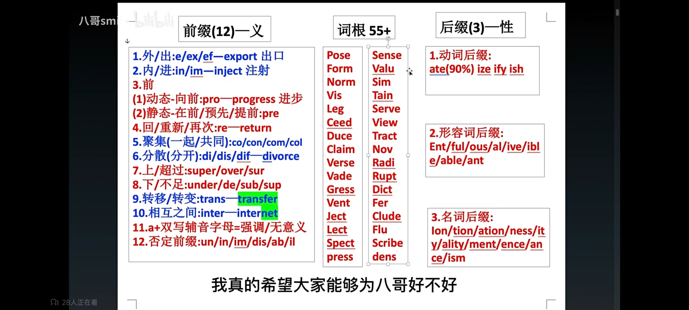

# 英语学习汁词根词缀
[回到主页](../../主页.md)
*众嗦粥汁，英语学习中词汇是一个大头*
```
词汇的学习，确实某种程度上来说枯燥无味。
但是回想起自己时如何认识世界的，或许便能找到
对于词汇学习的解答。
当你在提及一张桌子的时候，你会指着桌子说：
“这是桌子！”
但仅仅只是这样吗？
实际上，你会回忆起在此之上构筑的点滴回忆。
你可能会想起你和家人在桌子上的愉快晚餐，
一个名词后面代表的点点滴滴，这便是记忆的核心。
一个抽象名词的背后，
是不同的回忆的交织，情感的堆积。
回忆与情感，是我们认识世界的法则。
```
---
# 目录
- [常用前缀](prefix.md)
- [常用后缀](subfix.md)

---


以上是我要学习的词根词缀。  
词根词缀的来源是历史的演化，是前人的堆积。  
一定很有趣吧！  
去探寻吧！  