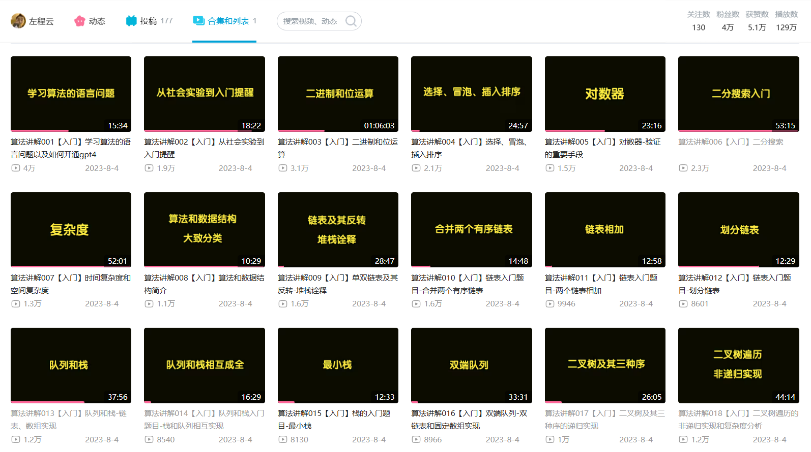

>>代价为彩笔

历时一天，将左神的**算法通关**看了18章  
每个都很长很细，不过因为之前看**代码随想录**有基础  
所以选择跳着看  
讲的非常好啊，很适合我长期学习
其他就不赘述了。

先讲讲今天学了什么。 

总的来说就是复习，狠狠的复习了一遍以前的知识  
还多了个新知识，对数机  
是用来针对已有方案进阶的东西，很不错

如图所示，很多很基础的内容  
不知道怎么说，但是总觉得  
看完之后，有什么东西剥落下来  
又被我吞入腹中  